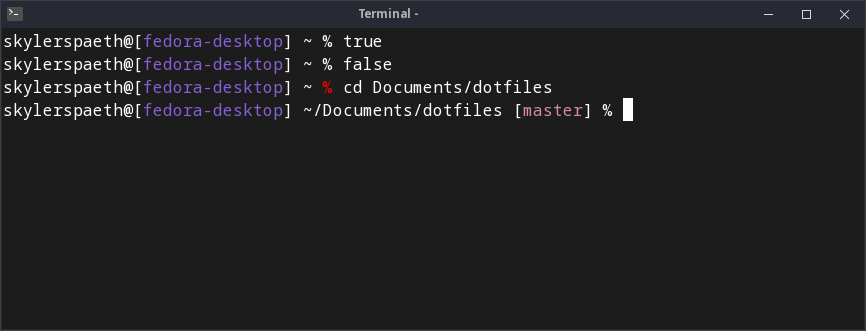

# DotFiles
This repo contains the most important of my Linux and macOS dotfiles. Currently, this includes:
- [`.zshrc`](#zshrc)
- [`.vimrc`](#vimrc)

## Installation
If you'd like to install any of the RCs from this repo, simply wget the one you want. For instance for zshrc (from anywhere):
```
wget -P ~ https://raw.githubusercontent.com/skylerspaeth/DotFiles/master/.zshrc
```
Keep in mind wget will append a `.1` if the file already exists, so you'd need to rename accordingly.


Or, if you don't have wget, with curl:
```
(cd ~ && curl -O https://raw.githubusercontent.com/skylerspaeth/DotFiles/master/.zshrc)
```
Since curl will overwrite an existing file, make sure you don't care about anything in your current zshrc (if present).

## .zshrc


This RC really just contains a custom prompt. My zsh prompt shows your current git branch in brackets, if applicable, and changes the color of the `%` character to red if the previous command fails with a nonzero exit code.

The git branch is retrieved using Will Bender's ([@Ragnoroct](https://github.com/Ragnoroct)) extremely quick git branch getter function from [his bashrc](https://gist.github.com/Ragnoroct/c4c3bf37913afb9469d8fc8cffea5b2f). He cites David Wolever's ([@wolever](https://github.com/wolever)) [bashrc](https://gist.github.com/wolever/6525437) for most of the git branch getter work.

The prompt uses the following format:
```
username@[hostname] ~/path [branch] %
```
Accent colors are added to the bracketed text (hostname & branch) to make the prompt more visually appealing.
## .vimrc
I don't have much to say about this RC. It's literally just my vimrc, the way I like vim. One thing to note is that [Vim-Plug](https://github.com/junegunn/vim-plug) is required for vim to not error out on launch due to a plugin I'm importing. You can choose to omit this part from your RC, install Vim-Plug manually, or [add the installer to your vimrc](https://github.com/junegunn/vim-plug/wiki/tips#automatic-installation) to set it up automatically on any computer.
